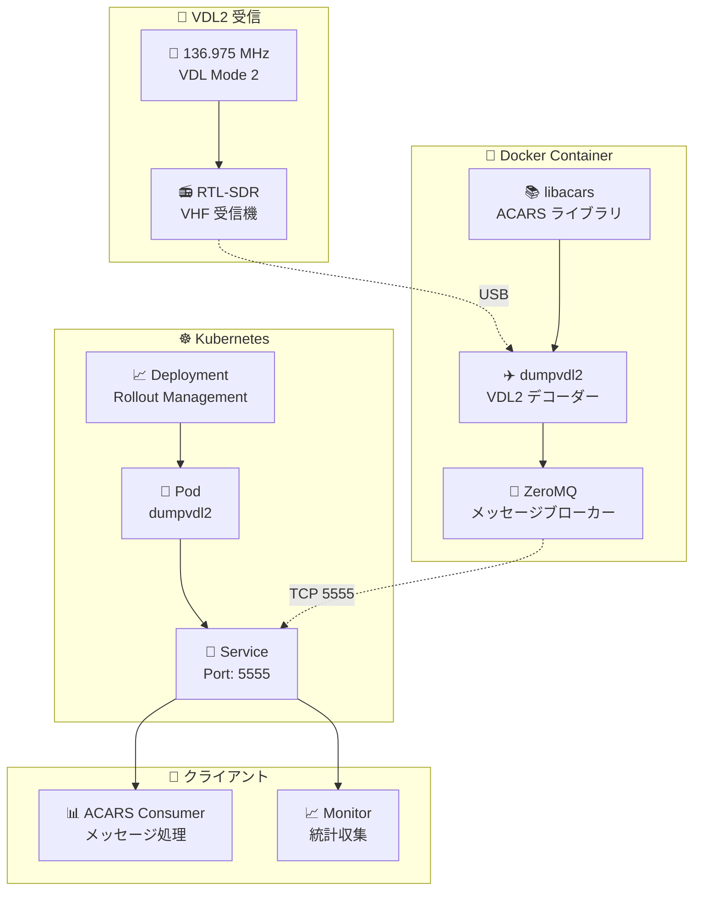
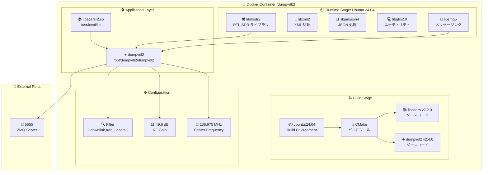
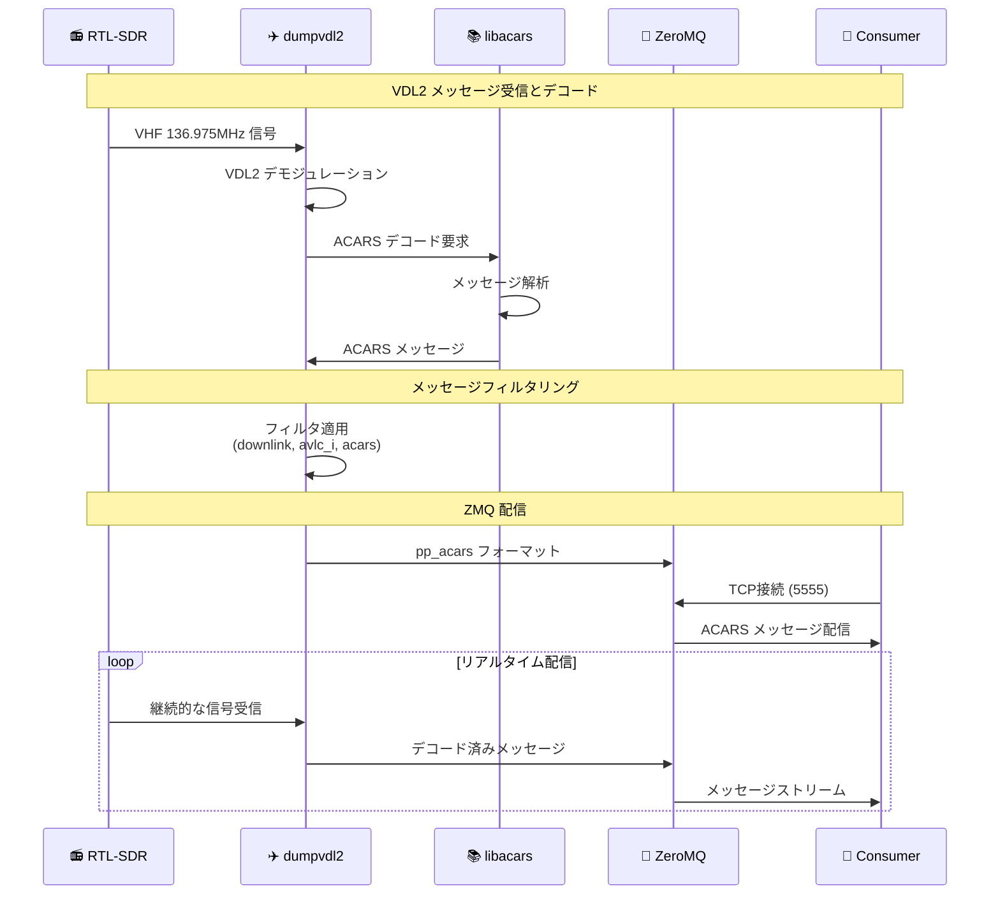
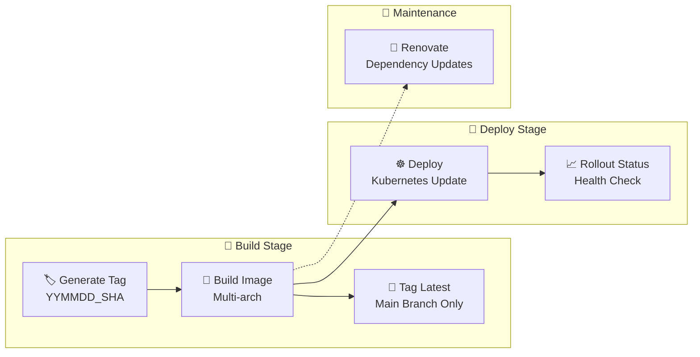

# ✈️ dumpvdl2 Docker

Kubernetes 対応の dumpvdl2 コンテナ化プロジェクト

[](https://gitlab.green-rabbit.net/kimata/dumpvdl2/-/pipelines)

## 📑 目次

- [📋 概要](#-概要)
  - [主な特徴](#主な特徴)
- [🏗️ システム構成](#️-システム構成)
  - [アーキテクチャ概要](#アーキテクチャ概要)
  - [コンテナ構成](#コンテナ構成)
  - [データフロー](#データフロー)
- [🚀 セットアップ](#-セットアップ)
  - [必要な環境](#必要な環境)
  - [1. リポジトリのクローン](#1-リポジトリのクローン)
  - [2. Docker イメージのビルド](#2-docker-イメージのビルド)
- [💻 実行方法](#-実行方法)
  - [Docker で実行](#docker-で実行)
  - [Kubernetes で実行](#kubernetes-で実行)
- [🔧 設定](#-設定)
  - [dumpvdl2 パラメータ](#dumpvdl2-パラメータ)
  - [メッセージフィルタ](#メッセージフィルタ)
- [📊 CI/CD](#-cicd)
  - [GitLab CI パイプライン](#gitlab-ci-パイプライン)
  - [自動デプロイ](#自動デプロイ)
- [🌐 ポート構成](#-ポート構成)
- [📝 ライセンス](#-ライセンス)

## 📋 概要

[dumpvdl2](https://github.com/szpajder/dumpvdl2) を Docker コンテナ化し、Kubernetes 環境での運用を可能にするプロジェクトです。VDL Mode 2 (VHF Data Link) 信号を受信して航空機のデータリンク通信をデコードし、ACARS メッセージを ZMQ 経由で配信します。

### 主な特徴

- 📦 **コンテナ化** - Docker による環境の標準化
- ☸️ **Kubernetes 対応** - クラスター環境での運用
- 📡 **VDL2 デコード** - 136.975 MHz での VHF データリンク受信
- 🔌 **ZMQ 配信** - ZeroMQ による ACARS メッセージのリアルタイム配信
- 🛡️ **マルチアーキテクチャ** - AMD64/ARM64 対応
- 🔄 **自動デプロイ** - GitLab CI/CD による継続的配信
- 📊 **ACARS 出力** - pp_acars フォーマットでのメッセージ配信

## 🏗️ システム構成

### アーキテクチャ概要



### コンテナ構成



### データフロー



## 🚀 セットアップ

### 必要な環境

- 🐳 Docker 20.10+
- ☸️ Kubernetes 1.20+ (クラスター運用時)
- 📻 RTL-SDR 対応USB受信機 (VHF対応)
- 🖥️ Linux 環境 (推奨: Ubuntu/Debian)

### 1. リポジトリのクローン

```bash
git clone https://github.com/kimata/dumpvdl2.git
cd dumpvdl2
```

### 2. Docker イメージのビルド

```bash
# マルチアーキテクチャビルド
docker buildx build --platform linux/amd64,linux/arm64/v8 -t dumpvdl2 .

# 単一アーキテクチャビルド
docker build -t dumpvdl2 .
```

## 💻 実行方法

### Docker で実行

```bash
# 基本実行 (RTL-SDR デバイス接続が必要)
docker run --rm -it \
  --device=/dev/bus/usb \
  -p 5555:5555 \
  dumpvdl2

# カスタム設定での実行
docker run --rm -it \
  --device=/dev/bus/usb \
  -p 5555:5555 \
  dumpvdl2 \
  /opt/dumpvdl2/dumpvdl2 \
  --rtlsdr VDL2 \
  --centerfreq 136975000 \
  --gain 49.6 \
  --msg-filter "downlink,avlc_i,acars,-acars_nodata" \
  --output "decoded:pp_acars:zmq:mode=server,endpoint=tcp://*:5555"

# ZMQ クライアントでの受信テスト
zmq_sub tcp://localhost:5555
```

### Kubernetes で実行

```bash
# Kubernetes デプロイメント
kubectl apply -f - <<EOF
apiVersion: apps/v1
kind: Deployment
metadata:
  name: dumpvdl2
  namespace: sensor
spec:
  replicas: 1
  selector:
    matchLabels:
      app: dumpvdl2
  template:
    metadata:
      labels:
        app: dumpvdl2
    spec:
      containers:
      - name: dumpvdl2
        image: registry.example.com/dumpvdl2:latest
        ports:
        - containerPort: 5555
        securityContext:
          privileged: true
        volumeMounts:
        - name: usb
          mountPath: /dev/bus/usb
      volumes:
      - name: usb
        hostPath:
          path: /dev/bus/usb
      nodeSelector:
        rtl-sdr: "true"
---
apiVersion: v1
kind: Service
metadata:
  name: dumpvdl2-service
  namespace: sensor
spec:
  selector:
    app: dumpvdl2
  ports:
  - name: zmq
    port: 5555
    targetPort: 5555
EOF
```

## 🔧 設定

### dumpvdl2 パラメータ

コンテナ起動時のデフォルトパラメータ：

| パラメータ | 値 | 説明 |
|----------|-----|------|
| 📻 **--rtlsdr** | VDL2 | RTL-SDR デバイス ID |
| 📡 **--centerfreq** | 136975000 | 中心周波数 (136.975 MHz) |
| 📊 **--gain** | 49.6 | RF ゲイン (dB) |
| 🔍 **--msg-filter** | downlink,avlc_i,acars,-acars_nodata | メッセージフィルタ |
| 🔌 **--output** | decoded:pp_acars:zmq:mode=server,endpoint=tcp://*:5555 | 出力設定 |

### メッセージフィルタ

デフォルトで以下のメッセージタイプをフィルタリング：

- ✅ **downlink** - ダウンリンクメッセージ
- ✅ **avlc_i** - AVLC 情報フレーム
- ✅ **acars** - ACARS メッセージ
- ❌ **-acars_nodata** - データなしACARSを除外

## 📊 CI/CD

### GitLab CI パイプライン



### 自動デプロイ

- 🎯 **トリガー**: main ブランチへのプッシュ
- 🏷️ **タグ生成**: `YYMMDD_CommitSHA` 形式
- 🏗️ **マルチアーキテクチャビルド**: AMD64/ARM64
- ☸️ **Kubernetes デプロイ**: sensor namespace
- ✅ **ヘルスチェック**: rollout status 確認
- 🚫 **スケジュール実行時**: デプロイスキップ

## 🌐 ポート構成

| ポート | プロトコル | 用途 | 説明 |
|--------|------------|------|------|
| 🔌 **5555** | TCP | ZMQ Server | ACARS メッセージの ZeroMQ 配信 |

## 📝 ライセンス

このプロジェクトのコンテナ化部分は Apache License Version 2.0 のもとで公開されています。

- dumpvdl2 本体は [szpajder/dumpvdl2](https://github.com/szpajder/dumpvdl2) の GPL v3 ライセンスに従います
- libacars は [szpajder/libacars](https://github.com/szpajder/libacars) の MIT ライセンスに従います

---

<div align="center">

**⭐ このプロジェクトが役に立った場合は、Star をお願いします！**

[🐛 Issue 報告](https://github.com/kimata/dumpvdl2/issues) | [💡 Feature Request](https://github.com/kimata/dumpvdl2/issues/new) | [📖 dumpvdl2 公式](https://github.com/szpajder/dumpvdl2)

</div>